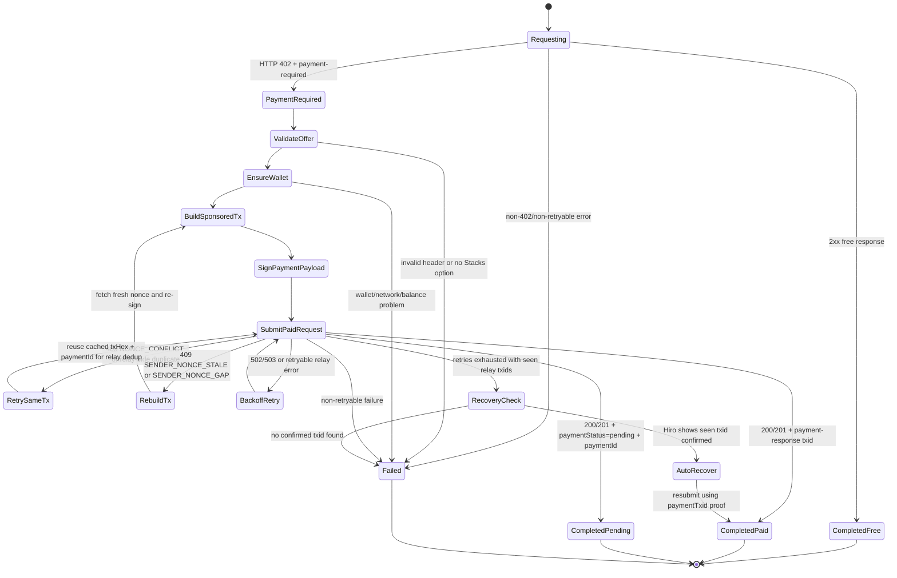
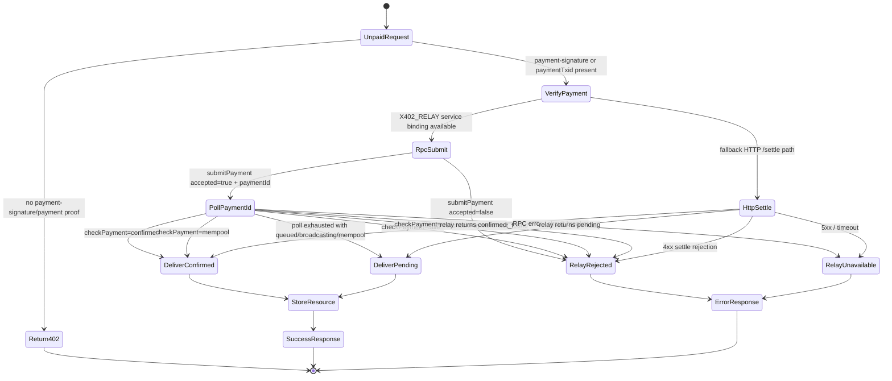
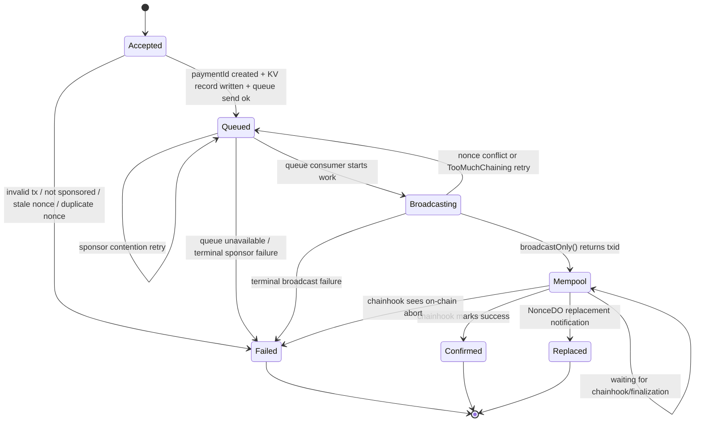
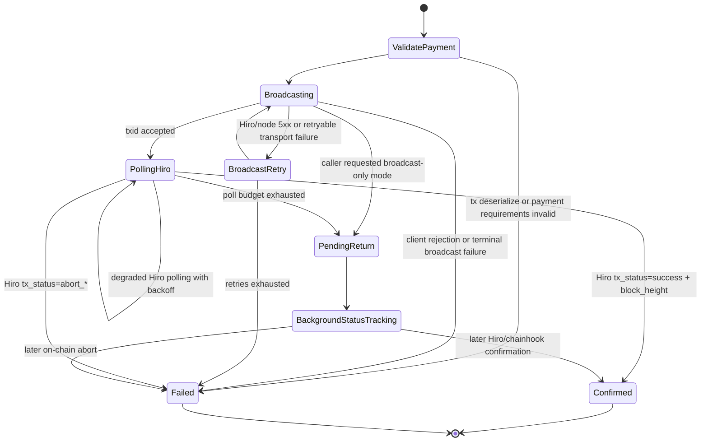
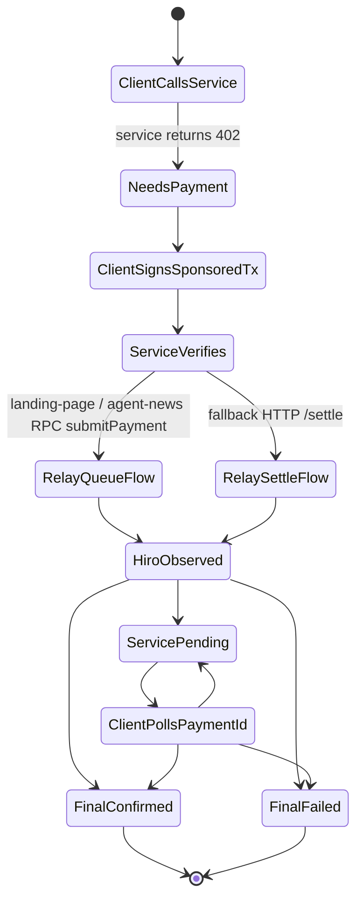

# x402 and Sponsored Transaction State Machines

Related review document:

- `x402-approval-spec.md` defines the target approval bar, transport boundaries, and reduction-first architecture expectations for this flow.

These diagrams reflect the implemented flow across:

- `aibtcdev/skills`
- `aibtcdev/aibtc-mcp-server`
- `aibtcdev/landing-page` (`aibtc.com`)
- `aibtcdev/agent-news` (`aibtc.news`)
- `aibtcdev/x402-sponsor-relay`
- Hiro API

## 1. Client State Machine: `skills` and `aibtc-mcp-server`

This is the client-side control flow used when an x402-protected endpoint returns `402 Payment Required`.

Notes:

- `aibtc-mcp-server/src/services/x402.service.ts` does the generic `402 -> sign -> retry once` flow.
- `skills/src/lib/utils/x402-retry.ts` and `aibtc-mcp-server/src/tools/inbox.tools.ts` add inbox-specific nonce recovery, same-tx dedup retries, and txid auto-recovery.

## 2. Service State Machine: `aibtc.com` and `aibtc.news`

This is how the service workers behave after receiving a paid request.

What the service returns:

- `confirmed` or `mempool`: resource is delivered normally.
- `pending`: resource is still delivered, but response includes `paymentStatus: "pending"` and `paymentId`.
- `failed`, `replaced`, `not_found`, or relay unavailability: request fails.

## 3. Relay Queue Payment State Machine: `x402-sponsor-relay` RPC path

This is the async `paymentId` lifecycle behind `submitPayment()` and `checkPayment()`.

Stored `paymentId` statuses exposed by `checkPayment()`:

- Pending/in-flight: `queued`, `broadcasting`, `mempool`
- Terminal: `confirmed`, `failed`, `replaced`
- Missing/expired: `not_found`

The relay may still track a more detailed internal acceptance/submission step, but caller-facing RPC and HTTP contracts should collapse that into `queued`.

## 4. Direct Relay Settlement State Machine: `/settle` to Hiro final status

This is the synchronous/native settlement flow used by the relay itself when handling direct `/settle` or `/relay` style settlement logic.

Important Hiro-specific behavior:

- `success` is only terminal when `block_height` is present.
- `abort_*` is terminal failure.
- `dropped_*` is treated as transient and the relay keeps polling.
- If polling budget expires, relay returns `pending` and status is updated later via KV + background/chainhook updates.

## 5. End-to-End View

## Code Anchors

- Client payment interceptor:
  - `aibtc-mcp-server/src/services/x402.service.ts`
  - `skills/src/lib/services/x402.service.ts`
- Client inbox retry and recovery:
  - `skills/src/lib/utils/x402-retry.ts`
  - `skills/src/lib/utils/x402-recovery.ts`
  - `aibtc-mcp-server/src/tools/inbox.tools.ts`
- Service verification and pending-success behavior:
  - `landing-page/app/api/inbox/[address]/route.ts`
  - `landing-page/app/api/payment-status/[paymentId]/route.ts`
  - `agent-news/src/services/x402.ts`
  - `agent-news/src/routes/payment-status.ts`
- Relay async payment status:
  - `x402-sponsor-relay/src/rpc.ts`
  - `x402-sponsor-relay/src/services/payment-status.ts`
  - `x402-sponsor-relay/src/queue-consumer.ts`
  - `x402-sponsor-relay/src/endpoints/chainhook.ts`
  - `x402-sponsor-relay/src/durable-objects/nonce-do.ts`
- Relay Hiro settlement polling:
  - `x402-sponsor-relay/src/services/settlement.ts`
